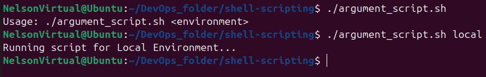
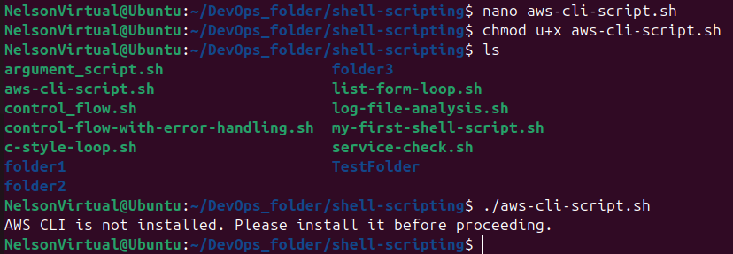
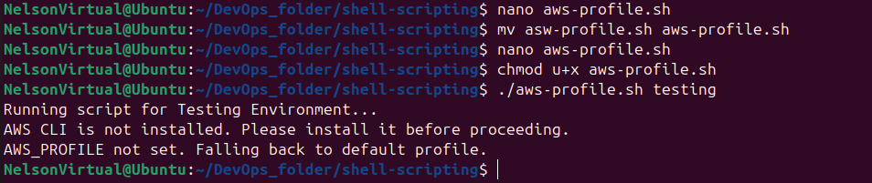

# linux-shell-scripting-functions
This is a project to demonstrate how functions are created and used in shell scripting.

Functions are one of the ways of organizing code for clarity and efficiency. they are re-usable blocks of code that perform specific tasks.

The following logic can be encapsulated in functions;
1. Check if a script has an argument
2. Check if AWS CLI is installed
3. Check if environment variable exists to authenticate to AWS

## Defining a function

The basic syntax for defining a function is;

```bash
function_name() { 
    # Function body
    # Commands or logic
}
```

**function_name:** This is a descriptive name of the function.

**():** This is used to define the function

**{}:** This enclosed the body of the function including the commands and logic defined.

### Checking if a script has an argument
Here is an example of a script that is not wrapped in a function. 

```bash
#!/bin/bash


# Checking the number of arguments
if [ "$#" -eq 0 ]; then
    echo "Usage: $0 <environment>"
    exit 1
fi

# Accessing the first argument
ENVIRONMENT=$1

# Acting based on the argument value
if [ "$ENVIRONMENT" == "local" ]; then
    echo "Running script for local Environment..."
elif [ "$ENVIRONMENT" == "testing" ]; then
    echo "Running script for Testing Environment..."
elif [ "$ENVIRONMENT" == "production" ]; then
    echo "Running script for Production Environment..."
else
    echo "Invalid environment specified. Please use 'local', 'testing', or 'production'."
    exit 2
fi
```

This same script can be written as two separate functions and it would appear as follows;

```bash
#!/bin/bash

# Function to check the number of arguments
check_num_of_args() {
    if [ "$#" -eq 0 ]; then
        echo "Usage: $0 <environment>"
        exit 1
    fi
}

# Function to run based on environment
run_environment() {
    ENVIRONMENT=$1

    if [ "$ENVIRONMENT" = "local" ]; then
        echo "Running script for Local Environment..."
    elif [ "$ENVIRONMENT" = "testing" ]; then
        echo "Running script for Testing Environment..."
    elif [ "$ENVIRONMENT" = "production" ]; then
        echo "Running script for Production Environment..."
    else
        echo "Invalid environment specified. Please use 'local', 'testing', or 'production'."
        exit 2
    fi
}
```
#### Calling a function
When a function is defined in a shell script, it has to be called in order for it to perform its intended task. Calling the function entails providing its name and necessary arguments at relevant section(s) of the script.

At the bottom of the script type in the following command to call the functions

```bash
# ----- Main Script -----

check_num_of_args "$@"      # call function 1
run_environment "$1"        # call function 2
```

From the command line you are to run the script with the necessary variables; Lets demonstrate running with and without a variable.

For example if you enter `./argument_script.sh` in the command line without argument the script will execute the first functin and return the following output;

```bash
Usage: ./argument_script.sh <environment>
```
Indicating that no variable (argument) was supplied.

Now run the script again this time supplying an argument e.g. 'local' `./argument_script.sh local`

This will output the follow after running the functions;

```bash
Running script for local Environment...
```


### Checking if AWS CLI is installed
Create a script named aws-cli-script.sh and enter the following commands;

```bash
#!/bin/bash

# Function to check if AWS CLI is installed
check_aws_cli() {
    if ! command -v aws &> /dev/null; then
        echo "AWS CLI is not installed. Please install it before proceeding."
        return 1
    fi
}
```

**if !**: checks if the command fails (if AWS CLI is not installed).

**command -v aws**: checks if the program AWS (AWS CLI) is in the system (PATH). if it exists, it prints the location and exits successfully.

**&> /dev/null**: hides the default output and uses the user defined output instead.

**return 1**: Ends the function and returns exit status 1 which means failure.

#### Calling the function
Enter the following command at the bottom of the script;

```bash
# ---- Main script starts here ----

# Call the function
if ! check_aws_cli; then
    # If the function returned 1 (failed), stop the script
    exit 1
fi

echo "AWS CLI is installed. Continuing with the script..."
# Here you can put the rest of your AWS-related commands
```

Save the script and run it.




### Check if environment variable exist to authenticate to AWS
When working with the AWS CLI, you need two main things:
1. Credentials & configuration to tell AWS who you are and where to work.
2. Profiles or environment variables to easily switch between different accounts or environments.
   
#### AWS Environment Variables
Environment variables are like temporary settings stored in your shell session.

```
export AWS_ACCESS_KEY_ID="your-access-key"
export AWS_SECRET_ACCESS_KEY="your-secret-key"
export AWS_DEFAULT_REGION="us-east-1"
export AWS_PROFILE="default"
```

These variables tell AWS CLI who you are and which region/profile to use.

#### AWS Profiles
Profiles let you store multiple sets of credentials in ~/.aws/credentials and ~/.aws/config.

```
[default]
aws_access_key_id = AKIAxxxxxxxx
aws_secret_access_key = abcdxxxxxxxx

[dev-account]
aws_access_key_id = DEVKEYxxxxxxx
aws_secret_access_key = DEVSECRETxxxxxxx

[default]
region = us-east-1
output = json

[profile dev-account]
region = eu-west-1
output = text
```

You can switch between profiles by setting the AWS_PROFILE variable:
export AWS_PROFILE=dev-account
aws s3 ls

Lets do this with a script to check if;
```
1. Arguments are given (environment selection).
2. Which environment you want (local, testing, productin).
3. AWS CLI is installed.
4. An AWS profile is set (falls back to default if mission).
```

Create a script called `aws-profile.sh` and enter the following commands;

```bash
#!/bin/bash


# Function to check number of arguments
check_num_of_args() {
    if [ "$#" -eq 0 ]; then
        echo "Usage: $0 <environment>"
        exit 1
    fi
}

# Function to activate infra environment
activate_infra_environment() {
    ENVIRONMENT=$1
    if [ "$ENVIRONMENT" == "local" ]; then
        echo "Running script for Local Environment..."
    elif [ "$ENVIRONMENT" == "testing" ]; then
        echo "Running script for Testing Environment..."
    elif [ "$ENVIRONMENT" == "production" ]; then
        echo "Running script for Production Environment..."
    else
        echo "Invalid environment specified. Please use 'local', 'testing', or 'production'."
        exit 2
    fi
}

# Function to check if AWS CLI is installed
check_aws_cli() {
    if ! command -v aws &> /dev/null; then
        echo "AWS CLI is not installed. Please install it before proceeding."
        return 1
    fi
}

# Function to check if AWS profile is set (fallback to default)
check_aws_profile() {
    if [ -z "$AWS_PROFILE" ]; then
        echo "AWS_PROFILE not set. Falling back to default profile."
        export AWS_PROFILE=default
    fi
}

# ---- Run checks ----
check_num_of_args "$@"
activate_infra_environment "$1"
check_aws_cli
check_aws_profile

```

Run the script


---

## Conclusion

In this lesson, we explored how shell scripting functions can make scripts cleaner, more reusable, and easier to maintain. We learned to:
- Check if a script has the right arguments before running.
- Verify if AWS CLI is installed before executing AWS commands.
- Work with AWS environment variables and profiles for secure and flexible authentication.

By using functions, you break large scripts into smaller, testable parts and avoid repeating code. This approach improves both clarity and reliability when automating infrastructure tasks such as provisioning EC2 instances or managing S3 buckets.
